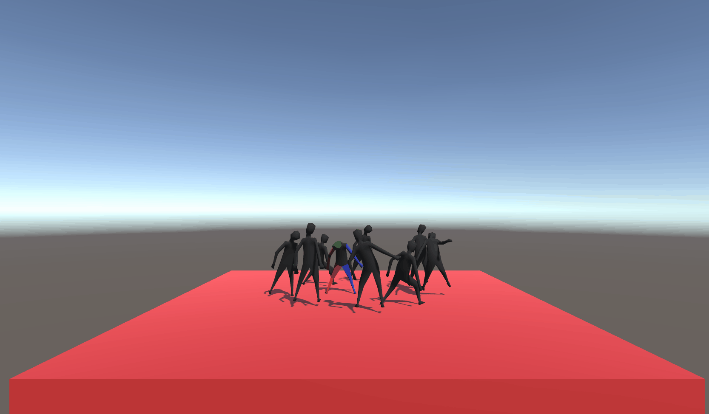
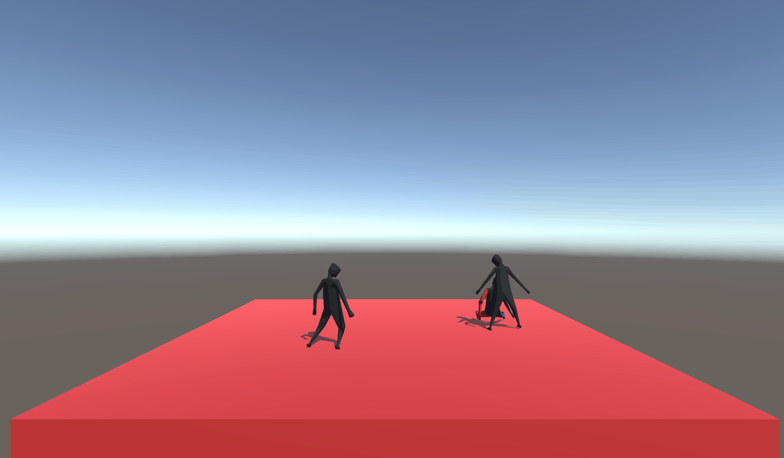
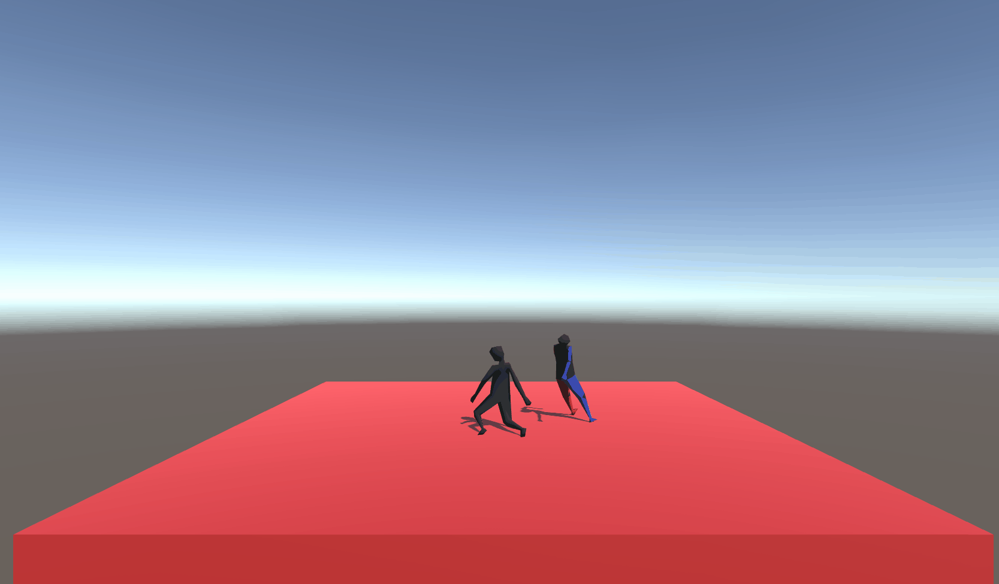
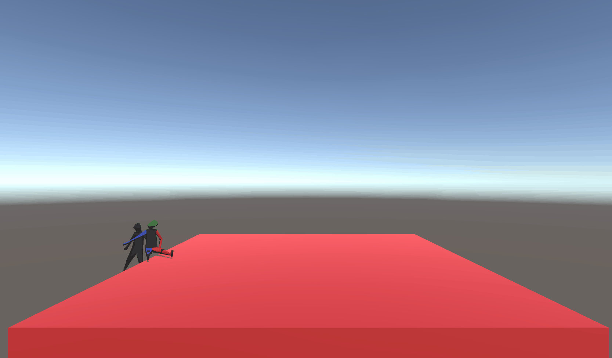

# PrevailOnTheDanceFloor
### a.k.a a 3D "get off my lawn - dancefloor edition" simulator!

Created for BC Game Jam 2020. Theme: Prevail

## Game Pitch

You are trying to enjoy a peaceful night of dance, but all these people on the dancefloor keep pushing you and making you feel uncomfortable. But no people, no problem, right? Push everyone off, and you will be the one to prevail on the dancefloor tonight!

## How it was created

* Unity 
* Lots of tutorials
* Questionable design decisions (it's a 48-hour event, these are inevitable)

## Try it out!

A zipped folder of our packaged game has been added to the repo, so anyone who is interested can download it and try out our game

## Not convinced yet?

Maybe this stunning imagery of our magnificent gameplay will blow your socks off and convince you otherwise!
  
  
  You start out as an innocent and unsuspecting person pushed right into the midst of dancing and colliding bodies

  
  You grow irritated with every passing second. You can't stand this any longer. You start pushing people off the dance floor for misbehaving. They totally deserve it for ruining your peaceful night of dance!

  
  The less people there are on the dance foor, the more peaceful it gets. You can even enjoy a little moment of dance with those who remain!

  
  But there can only be one winner tonight.

#### Thanks for making it all the way down there! Hope to see you on the dancefloor tonight! >;3
